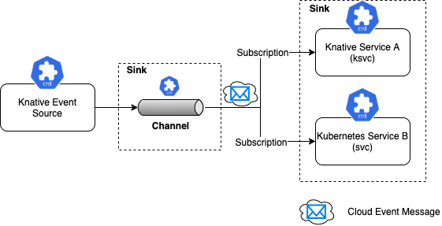

# Drinking from the Firehose
A very common use case for Serverless is responding to a stream of events. These events can represent almost anything within the context of your system but the powerful idea here is the separation of the consumer from the producer of these events. This allows for massively scalable architectures while still being able to offer real time capabilities.

In this lab, we will be using the popular event streaming technology called Apache Kafka. In addition to its scalability, Kafka also provides event persistence which allows for the ability of event consumers to resume reading from where they left off in the event of consumer failure. Using Kafka as the Knative Event Source means that our Knative Eventing system inherits all of the benefits of Kafka, including its scalability and persistence features.

## Usage Patterns
There are three main usage patterns in Knative Eventing.

### Source to Sink
This is the simplest of all three. There is a single Knative Event Source from where all events get sent to a single Sink. A Sink is a service that will receive and process that particular event. The Event Source itself is very simple. It does not support queuing, backpressure, or filtering. It also does not wait for, nor expect any response from the Sink. This message pattern is very comparable to the "fire and forget" messaging pattern.


### Channel and Subscription
This usage pattern is the one where we can introduce Kafka, but first let's talk about how this pattern works. Similar to the Source to Sink pattern, we start with a Knative Event Source. This time however, the Sink is not a service, but is a Channel. For a single Channel, there can be many Knative Sink Services that "subscribe" and receive events from that specific Channel. These Knative Sink Services can be either a Knative or Kubernetes Service.

An important thing to note here is that the event from Channel to Knative Sink Service is different than the event from the Knative Event Source to the Channel.  Once an event is received by the Channel, all future events flowing through the Knative system implements a vendor agnostic, CNCF specification known as a CloudEvent.

Using Kafka as a concrete example, we can walk through the flow.  First, the Knative Event Source is implemented by the KafkaSource, which reads events from an Apache Kafka Cluster.  KafkaSource passes these events onto a Knative Sink, in this case, a KafkaChannel, where it is backed by Kafka topics. KafkaChannel then creates CloudEvents that are sent to every Knative Sink Service that has subscribed to the Channel. Lastly the Knative Sink Service wakes up and runs.



### Broker and Trigger
This usage pattern is very similar to Channel and Subscription with a few key differences. The most notable is the fact that Triggers allow for filtering on the CloudEvent. This means you get a fine grained control over the exact types of events and that fire up a particular Knative (or Kubernetes) Service.

The other difference is that the Knative Event Source sends events to a Broker.  The Broker implicitly creates a Knative Eventing Channel as opposed to the Source to Sink where we explicitly created the Channel. The other difference is that instead of Knative Sink Services subscribing to the Channel, here we have Triggers that subscribed to Brokers, and these Triggers then call the Knative Service.

It would be helpful to walk through a concrete example, again using Kafka. Like before, we have a KafkaSource that reads events from an Apache Kafka Cluster. KafkaSource would by default send these events to the MTChannelBasedBroker (Multi Tenant Channel Based Broker). This is an in-memory channel. However for persistence, we can swap that for a KafkaChannel.

To illustrate how easy, here is a code snippet of how to do that:

```
eventing.knative.dev/broker.class: MTChannelBasedBroker
eventing.knative.dev/broker.class: Kafka
```

Next, there are a number of Knative Eventing Triggers that subscribe to this Broker. The Channel itself is the mechanism that provides the event routing functonality to get the events to the subscribed Triggers. The Trigger receives the CloudEvent and has knowledge of the exact type of filtering it needs to perform as well as the exact Knative or Kubernetes service that need to be invoked.


## Deploy Service
