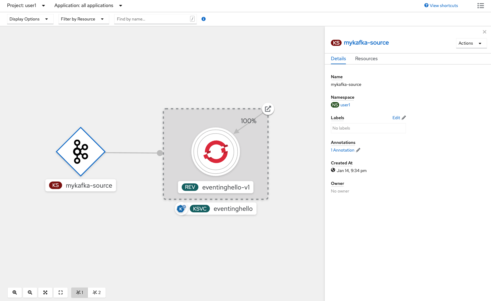

# Drinking from the Firehose
A very common use case for Serverless is responding to a stream of events. These events can represent almost anything within the context of your system but the powerful idea here is the separation of the consumer from the producer of these events. This allows for massively scalable architectures while still being able to offer real time capabilities.

In this lab, we will be using the popular event streaming technology called Apache Kafka. In addition to its scalability, Kafka also provides event persistence which allows for the ability of event consumers to resume reading from where they left off in the event of consumer failure. Using Kafka as the Knative Event Source means that our Knative Eventing system inherits all of the benefits of Kafka, including its scalability and persistence features.

## Architecture

### Channel and Subscription
Entry into the Serverless sytems starts with a Knative Event Source. The role of a Knative Event Source is to convert an external event, in this case a Kafka event, into a special vendor agnostic, Cloud Native Computing Foundation (CNCF) event, called a [CloudEvent](https://cloudevents.io).

From the event source, the CloudEvent is sent to a Channel. Channels then send CloudEvents to "subscribed" Knative (or Kubernetes) Services. Many services can subscribe to a given Channel.


## Verify Kafka Setup
Kafka has already been installed for you using the Red Hat Integration - AMQ Streams operator.  You can verify this by running

```
oc get operators -o name | grep amq
```

You will see

```
operator.operators.coreos.com/amq-streams.openshift-operators
```

Also verify the Kafka cluster exists.

```
oc get kafka -n kafka
```

You should see `my-cluster`.

```
NAME         DESIRED KAFKA REPLICAS   DESIRED ZK REPLICAS
my-cluster   1                        1
```

## Knative Eventing

Already installed for you are the Kafka and Knative components specially designed to allow Kafka and Knative to work together.  You can see these components by looking at the pods running in the `knative-eventing` namespace.  Notice the `kafka-` pods that allow the `KafkaSource` and `KafkaChannel` to be used by Knative.

```
oc get pods -n knative-eventing
```

```
NAME                                               READY   STATUS      RESTARTS   AGE
eventing-controller-848bcbd4f9-7zz68               1/1     Running     0          3d13h
eventing-webhook-78dcf96448-6568h                  1/1     Running     0          3d13h
imc-controller-8559ff856b-2sdk6                    1/1     Running     0          3d13h
imc-dispatcher-575c7fcd8d-lrpmt                    1/1     Running     0          3d13h
kafka-ch-controller-85f879d577-llzvp               1/1     Running     0          3d13h
kafka-ch-dispatcher-55d76d7db8-q9xzw               1/1     Running     0          3d13h
kafka-controller-manager-bc994c465-t5lv4           1/1     Running     0          3d13h
kafka-webhook-54646f474f-qstvz                     1/1     Running     0          3d13h
mt-broker-controller-56857cccc5-h49sp              1/1     Running     0          3d13h
mt-broker-filter-784b7db965-5ngkk                  1/1     Running     0          3d13h
mt-broker-ingress-6b9f847866-bhk5w                 1/1     Running     0          3d13h
sugar-controller-594784974b-rpvsm                  1/1     Running     0          3d13h
```

We can also see the various kinds of objects we will be using, starting first with the eventing sources.  Notice the `KafkaSource` api resource.

```
oc api-resources --api-group='sources.knative.dev'
```

```
NAME               SHORTNAMES   APIGROUP              NAMESPACED   KIND
apiserversources                sources.knative.dev   true         ApiServerSource
containersources                sources.knative.dev   true         ContainerSource
kafkasources                    sources.knative.dev   true         KafkaSource
pingsources                     sources.knative.dev   true         PingSource
sinkbindings                    sources.knative.dev   true         SinkBinding
```

Next we can see the specific eventing/messaging resources.  Notice the `Channel`.

```
oc api-resources --api-group='messaging.knative.dev'
```

```
NAME               SHORTNAMES   APIGROUP                NAMESPACED   KIND
channels           ch           messaging.knative.dev   true         Channel
inmemorychannels   imc          messaging.knative.dev   true         InMemoryChannel
subscriptions      sub          messaging.knative.dev   true         Subscription
```

### Knative Channel
Channels are the mechanism that actually forward events through the system, from the source (producer) to the sink (consumer). By default, all Knative Eventing API use the InMemoryChannel (imc), which is great to get started, but is not applicable for all use cases due to it's inability to persist messages. To get durability, we need to use other channels, such as GCP PubSub or Kafka.


### Verify Channel
Let's verify that we are configured to use the `KafkaChannel`.

```
oc describe KnativeEventing knative-eventing -n knative-eventing
```

You can see the default for `kafka` is `KafkaChannel`.  Here's the relevant snippet

```
Spec:
  Config:
    Default - Ch - Webhook:
      Default - Ch - Config:  clusterDefault:
  apiVersion: messaging.knative.dev/v1beta1
  kind: KafkaChannel
  spec:
    numPartitions: 1
    replicationFactor: 1
```

### Create Sink
We will now create a sink, a final destination for Kafka events flowing through the system. In this case, it will be a Serverless service. Let's create one now.

First let's make sure you are still in the right project.

```
oc project    # Using project "user$USER_NUMBER" on server...
```

Let's also make sure your user number is set.

```
export USER_NUMBER=x    # replace x with your number
```

Now we can create our sink.

```
oc apply -f https://raw.githubusercontent.com/RedHatGov/serverless-workshop-code/main/kafka/kafka-sink.yml
```

Verify that it is there and wait until it is ready

```
oc get ksvc
```

```
NAME            URL                                               LATESTCREATED      LATESTREADY        READY   REASON
eventinghello   http://eventinghello-xyz.sandbox373.opentlc.com   eventinghello-v1   eventinghello-v1   True
```

When Serverless services are created they are initially spun up, which is why we can see the logs

```
stern eventinghello -c user-container
```

Note, if you didn't run the `stern` command within ~90s of creating the sink, the container might have spun back down, but that's ok, you can keep going.

### Create Topic
We have a Kafka topic, we should now go ahead and create the Kafka topic.

```
curl -sS https://raw.githubusercontent.com/RedHatGov/serverless-workshop-code/main/kafka/kafka-topic.yml | sed "s/USER_NUMBER/$USER_NUMBER/" | oc apply -f -
```

Verify it was created

```
oc get kafkatopics
# a nice shortcut is `oc get kt`
```

```
NAME                                                                        PARTITIONS   REPLICATION FACTOR
my-topic-USER_NUMBER                                                        10           1
```

### Create KafkaSource Instance
Now we will create a KafkaSource instance that ties our topic to our sink.

```
curl -sS https://raw.githubusercontent.com/RedHatGov/serverless-workshop-code/main/kafka/kafka-source-to-sink.yml | sed "s/USER_NUMBER/$USER_NUMBER/" | oc apply -f -
```

Verify that it was created.

```
oc get kafkasource
```

```
NAME             TOPICS           BOOTSTRAPSERVERS                                      READY   REASON   AGE
mykafka-source   ["my-topic-USER_NUMBER"]   ["my-cluster-kafka-bootstrap.kafka:9092"]   True             8s
```

Using the web browser, click on over to the `Developer` view.  Then click `Topology` and make sure you are in the correct `Project`.  You can then verify the KafkaSource is configured correctly.



### See It In Action
Now let's see events flow through the Serverless system. Create a kafka producer.

In one terminal run

```
oc run kafka-producer -ti --image=strimzi/kafka:0.19.0-kafka-2.5.0 --rm=true --restart=Never -- bin/kafka-console-producer.sh --broker-list my-cluster-kafka-bootstrap.kafka:9092 --topic my-topic-$USER_NUMBER
```

In another terminal run

```
stern eventinghello -c user-container
```

Every message you type into the producer, will appear in the knative service logs (that you are viewing through `stern`), along with other CloudEvent metadata.

```
eventinghello-v1-deployment-5dc76db76c-6b7np user-container 2021-01-12 17:31:57,326 INFO  [eventing-hello] (executor-thread-1) POST:this is a test
```

When you are done, send the kill command to each terminal (ctrl-c) and make sure the `kafka-producer` pod is properly deleted.

```
oc delete pod kafka-producer
# it's ok to get "error: the server doesn't have a resource type "kafka-producer""
```

### Turn on the Firehose
Time to add more events and watch the system process them.

In one terminal watch the pods

```
watch oc get pods
```

In another terminal, run the kafka-spammer.

```
oc run kafka-spammer -it --image=jonnyman9/kafka-python-spammer:latest --rm=true --restart=Never --env KAFKA_BOOTSTRAP_HOST=my-cluster-kafka-bootstrap.kafka --env TOPIC_NAME=my-topic-$USER_NUMBER --env TIMES=10
```

In the first terminal watching the pods, you should see 1 or more new pods.

```
NAME                                                              READY   STATUS    RESTARTS   AGE
eventinghello-v1-deployment-f48945f8b-56sal                       2/2     Running   0          9s
```

If you want to, feel free to open another terminal to watch the logs

```
stern eventinghello -c user-container
```

And try to run the `kafka-spammer` again, this time, increasing `TIMES` to 100 or more.

```
oc delete pod kafka-spammer
oc run kafka-spammer -it --image=jonnyman9/kafka-python-spammer:latest --rm=true --restart=Never --env KAFKA_BOOTSTRAP_HOST=my-cluster-kafka-bootstrap.kafka --env TOPIC_NAME=my-topic-$USER_NUMBER --env TIMES=100
```

The Serverless system will spin up enough Serverless applications that are required in order to keep up with processing of the Kafka events.  Our application doesn't do much and as a result is able to keep up the volume of events that we push through the system.

###  Cleanup

```
oc delete kafkasource mykafka-source
oc delete kafkatopic my-topic-$USER_NUMBER
oc delete ksvc eventinghello
```

## Summary

You were able to setup your own Kafka Topic and tie a Serverless application to it.  You sent messages to this topic through the command line as well as through a spammer utility.  For each message, the Serverless application you configured would print out the message it received.  When no messages were being sent from the topic, the Serverless application would idle and then be terminated, freeing up the resources it required.  Even when the topic was flooded with messages, the system is able to keep up, potentially spinning up more Serverless applications to handle the load.
