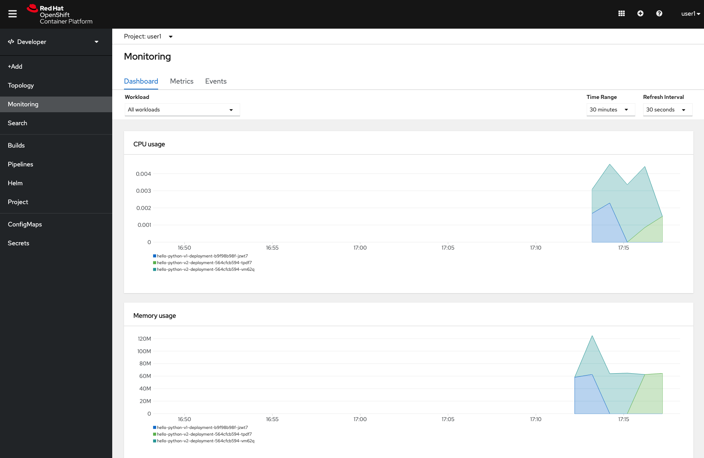

# The Operator Stakeholder

There are many types of users from different types of roles that can all benefit from Serverless. We saw in a previous lab how Serverless benefits developers and in this section, we will examine how it can also improve operations and simplify deployment and management of these applications.

A Serverless service is like an easy button for deploying services in OpenShift. In about 22 lines of yaml, a Serverless service automatically creates for you the equivalent of:

1. Deployment configuration
2. New immutable revision of the service
3. Route
4. Service
5. Horizontal Pod Autoscaler

For a developer, yaml might not be their preferred method of deployment, but for operations embracing the notion of gitops, a yaml deployment configuration that can be version controlled and tracked is the ideal artifact for that workflow.

## Deployment

First, make sure you're in the right project.

```
# replace X with your assigned number
export USER_NUMBER=X
oc project user$USER_NUMBER
```

Now let's deploy our `hello-python` app from earlier, this time using a yaml file.

```
curl -sS https://raw.githubusercontent.com/RedHatGov/serverless-workshop-code/deployment/hello-python.yml | oc apply -f -
```

Here's how that file looks, with comments added.

```
# Knative service
apiVersion: serving.knative.dev/v1
kind: Service
metadata:
  # name of the service
  name: hello-python
spec:
  template:
    metadata:
      # optional name of our revision
      name: hello-python-v1
    spec:
      containers:
        # image that will be deployed
        - image: quay.io/jkeam/hello-python:latest
          env:
            - name: TARGET
              value: "Python"
```

Let's verify that our application was deployed.

```
oc get ksvc
```

We can also see the public route (URL).

```
NAME           URL                                                                                      LATESTCREATED     LATESTREADY       READY   REASON
hello-python   http://hello-python-user-1.apps.cluster-tysons-5b24.tysons-5b24.sandbox891.opentlc.com   hello-python-v1   hello-python-v1   True
```

Open the URL in your browser and you should see

```
Hello Python!
```

## Deployment v2
Let's imagine now that the development team has delivered a new version of the `hello-python` application.

```
curl -sS https://raw.githubusercontent.com/RedHatGov/serverless-workshop-code/deployment/hello-python-v2.yml | oc apply -f -
```

Here's that new deployment file, with comments added.

```
apiVersion: serving.knative.dev/v1
kind: Service
metadata:
  name: hello-python
spec:
  template:
    metadata:
      # new name of our revision
      name: hello-python-v2
    spec:
      containers:
      containers:
        - image: quay.io/jkeam/hello-python
          # new environment variable applied to this configuration so we can tell the difference between our service versions
          env:
            - name: TARGET
              value: "Python v2"
```

Let's verify that our new version was deployed.

```
oc get ksvc
```

We can also see the public route (URL).

```
NAME           URL                                                                                      LATESTCREATED     LATESTREADY       READY   REASON
hello-python   http://hello-python-user-1.apps.cluster-tysons-5b24.tysons-5b24.sandbox891.opentlc.com   hello-python-v2   hello-python-v2   True
```

Open the URL in your browser and you should see

```
Hello Python v2!
```

## Blue-Green Deployment

Deploying a new Knative service actually creates a new immutable revision and routes all traffic to it.  These immutable revisions allows us to have sophisticated deployment strategies.  The first we will examine is blue-green.

At a high level, blue-green deployment is the idea of having v1 (blue) running along side v2 (green).  When you are ready to go live with v2, you simply switch the router to route all traffic from v1 (blue) to v2 (green).  The nice thing about this approach is that if there is a problem with v2, you can easily rollback and switch the router to route all traffic back to v1.  You can read more about that [here](https://martinfowler.com/bliki/BlueGreenDeployment.html).

Let's reset all traffic back to v1.

```
curl -sS https://raw.githubusercontent.com/RedHatGov/serverless-workshop-code/deployment/hello-python-blue.yml | oc apply -f -
```

Here's the relevant section from that yaml file that controls the traffic distribution.

```
  traffic:
    - tag: v1
      revisionName: hello-python-v1
      percent: 100
    - tag: v2
      revisionName: hello-python-v2
      percent: 0
```

This directs all traffic back to v1 of our application.  Refresh the page and you will see the original `Hello Python!`.

Then let's pretend our team gets approval to switch to v2, we can apply the following to switch all traffic over.

```
curl -sS https://raw.githubusercontent.com/RedHatGov/serverless-workshop-code/deployment/hello-python-green.yml | oc apply -f -
```

You can see that all traffic has switched over to v2

```
  traffic:
    - tag: v1
      revisionName: hello-python-v1
      percent: 0
    - tag: v2
      revisionName: hello-python-v2
      percent: 100

```

Refresh the page and you will see the version 2 text.

## Canary Deployment

The immutable revisions coupled with our ability to configure traffic distribution means we can also do canary deployment.  A canary deployment has a few names, and you might have heard it referred to as phased or incremental rollout.  The idea here is that unlike a blue-green deployment where we cut over all traffic to the new version at one time, with canary we instead to this gradually.  This is a safer alternative because you can slowly and methodically route a small percentage of traffic to the new version, gradually increasing that percentage as you gain more confidence in your deployment until eventually you hit 100% until eventually you hit 100%.  The con is that you need to be running two versions of the application concurrently for some duration of time.  You can read more about this [here](https://martinfowler.com/bliki/CanaryRelease.html).

Let's try a canary deployment now.

```
curl -sS https://raw.githubusercontent.com/RedHatGov/serverless-workshop-code/deployment/hello-python-canary.yml | oc apply -f -
```

Notice the traffic is split 50/50.

```
  traffic:
    - tag: v1
      revisionName: hello-python-v1
      percent: 50
    - tag: v2
      revisionName: hello-python-v2
      percent: 50

```

The 50/50 is just an approximation, so don't expect this to be exact, but let's verify that traffic is indeed being split.

```
KNATIVE_SERVICE=$(oc get ksvc -o=jsonpath='{ .items[0].status.url }')
while true; do sleep 1; curl $KNATIVE_SERVICE; echo "";done
```

You could imagine steadily incrementing the percentage of traffic to version 2 until eventually we get to 100%.


## Monitoring Dashboard
We can monitor the resources that our serverless applications are using.  Make sure you are in the `Developer` view and click on the `Monitoring` tab and with the `Dashboard` tab selected, we can examine the CPU, memory, and bandwidth usage; among other metrics.  Feel free to click on the `Workload` dropdown to be able to look only at a specific revision.  Also feel free to click on `Metrics` to be able to write your own Prometheus Query, or on the `Events` tab to see events related to your applications.  One thing to note is that it takes a while for this data to show up, so if the graphs are empty, give it a few minutes to populate.

*OpenShift Serverless Monitoring*

## Summary
In this lab we examined how Serverless benefits operators and how it can fit into their workflow.  It greatly simplified creating different revisions of an application and then allowed for an easy way to roll new versions out to production.  In addition, Serverless applications behave like standard workloads deployed on OpenShift, making tasks like monitoring well understood and famililar.
