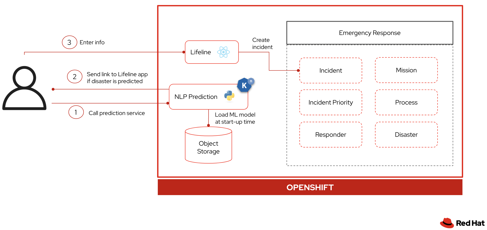

# Overview

In this lab, you will create a mobile user experience built with machine learning on OpenShift Serverless.

The use case is based on the [Emergency Response Demo](http://www.erdemo.io/) we built at Red Hat.  It is a demo application that simulates stranded residents in the middle of a disaster whom volunteer responders can rescue. In its current state, stranded residents register to the web application in order to request help.

You're going to build a mobile experience to augment the existing demo.  In this mobile experience, a person will be able to text a phone number to ask for help by sending details of the disaster they are experiencing.  On the backend, the system verifies if the message describes a legitimate disaster by using a machine learning Natural Language Processing (NLP) model.  If verification succeeds, the system replies to the user with a link to a mobile website to ask for help.  If it does not, the system asks for more details.  We will call this the **NLP Prediction Service** going forward.

The backend should scale up when people start asking for help, which is a good use case for OpenShift Serverless.

Here is the architecture:

You will focus on building, debugging, and deploying the NLP Prediction Service.  You will also integrate the following important components:

* [Lifeline](https://github.com/RedHatGov/serverless-workshop-code/tree/main/lifeline) - a React based web application
* [Twilio](https://www.twilio.com/) - a communications API for building the phone/text user interaction

Feel free to ask your instructor if you have any questions about this architecture.  Let's get started!