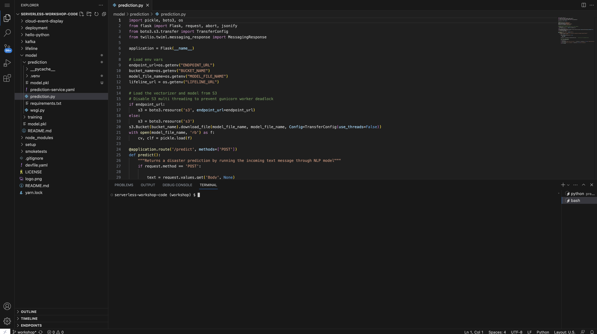

# Oops, there's a major bug!

In this lab, you will debug the `NLP Prediction Service` using [CodeReady Workspaces][1], an in-browser IDE running on OpenShift.  We have defined a workspace for you using a [devfile][2], which CodeReady Workspaces uses to create your workspace.  After debugging, you will release a new version of the code using OpenShift Serverless.

## Prep

Make a note of the following environment variables.  You will need to set these in your CodeReady Workspace terminal.

```execute
echo $AWS_ACCESS_KEY_ID
echo $AWS_SECRET_ACCESS_KEY
echo $ENDPOINT_URL
echo $BUCKET_NAME
```

## Debug

Get the endpoint to CodeReady and our devfile:

```execute
echo $(oc get route codeready -n openshift-workspaces --template='{{.spec.host}}')/f?url=https://github.com/RedHatGov/serverless-workshop-code/tree/workshop
```

Open the link in your browser.  Login using your username and password.  Authorize access to your account when requested.

You should see:


Enter fake account info and click Submit (You don't have to use real account information).

CodeReady creates a workspace for you using the devfile specified in our repo.  Wait a few minutes and you should see:


Let's pull up the code for debugging.  On the left, click the 'Explorer' icon:


Open the prediction code in the IDE, `serverless-workshop-code/model/prediction/prediction.py`:


You also need a terminal to run this code locally.  At the top, click 'Terminal' and 'Open Terminal in specific container':


Select the 'python' development container:


You should see a python terminal open in the bottom of your browser IDE:


At this point, you have access to two terminals.  Your workshop terminal (where you run your labs) and the CodeReady Workspace terminal (where you run the code locally).  

Let's configure your CodeReady Workspace terminal.  

> Execute the following steps in your CodeReady Workspace terminal.

Navigate to the prediction code directory:

```
cd serverless-workshop-code/model/prediction
```

Install the python dependencies:

```
pip install -r requirements.txt
```

Set your environment variables.  Make sure to substitute your values:

```
export AWS_ACCESS_KEY_ID=  
export AWS_SECRET_ACCESS_KEY= 
export ENDPOINT_URL=
export BUCKET_NAME=
export MODEL_FILE_NAME=model.pkl
```

Run the app locally in your CodeReady Workspace terminal:

```
FLASK_APP=prediction.py FLASK_ENV=development flask run
```

> Output

```
 * Serving Flask app "prediction.py"
 * Environment: development
   WARNING: This is a development server. Do not use it in a production deployment.
   Use a production WSGI server instead.
 * Debug mode: on
 * Running on http://127.0.0.1:5000/ (Press CTRL+C to quit)
```

The application is now running locally in CodeReady Workspace.  Open another terminal using the 'python' development container.  You should see:



> Execute the following steps in your second CodeReady Workspace terminal.

Send a sample request.  This should return 'No disaster':

```
curl -X POST -d 'Body=nothing to see here' 'http://localhost:5000/predict' | xmllint --format -
```

Send another sample request.  

```execute
curl -X POST -d 'Body=massive flooding and thunderstorms taking place' 'http://localhost:5000/predict' | xmllint --format -
```

Ok, this returns 'No disaster' when it should return 'This is a disaster!'  You were able to replicate the bug in this IDE.

<br>

Feel free to try debugging this code on your own.  Click below when you're ready to see the solution:

<details>
  <summary>Click here for the solution</summary>

  Lines 39 and 41 have the line `if prediction is True`.

  `prediction` is `1` if the model determines a disaster was detected.  This means the code is executing `if 1 is True`.  

  In python, the `is` operator tests if the objects have the same identity.  The integer `1` and boolean `True` do not have the same identity, so `1 is True` returns `False`.

  To fix this, replace `if prediction is True` to `if prediction == 1` on lines 39 and 41.  It should look like this:

  
  
</details>

<br>

After you make the necessary changes, Flask will auto-reload for you.

Let's try sending the sample requests again.

> Execute the following steps in your CodeReady Workspace terminal.

```
curl -X POST -d 'Body=massive flooding and thunderstorms taking place' 'http://localhost:5000/predict' | xmllint --format -
```

This returns `No disaster`.

```
curl -X POST -d 'Body=massive flooding and thunderstorms taking place' 'http://localhost:5000/predict' | xmllint --format -
```

This returns `This is a disaster!`

Perfect, this worked as intended.  You fixed the issue, and you are ready to deploy this to OpenShift Serverless.

## Deploy Private Service

OpenShift Serverless offers a capability to deploy a [cluster-local][3] service.  In a cluster-local service, the application is published to a private endpoint.

Let's leverage this to test our fix in OpenShift Serverless before we deploy this live.  We've already prepared the updated code for you in the [main branch](https://github.com/RedHatGov/serverless-workshop-code) of the repo.

> Note: Typically you would create a new commit on the same branch and kick off a build.  For workshop purposes, we'll create a separate build.

> Execute the following in your workshop terminal

Build the container image:

```execute
oc new-build python:3.6~https://github.com/RedHatGov/serverless-workshop-code --name prediction-2 --context-dir=model/prediction --to prediction
```

Wait until the build completes.

List the pods:

```execute
oc get pods
```

Output (sample):
```
NAME                   READY   STATUS      RESTARTS   AGE
prediction-1-build     0/1     Completed   0          2m4s
prediction-2-1-build   0/1     Completed   0          3m30s
```

Update the prediction service with the new version of the code and make it private using the `--cluster-local` flag:

```execute
PREDICTION_IMAGE_URI=$(oc get is prediction --template='{{.status.dockerImageRepository}}')
kn service update prediction --image $PREDICTION_IMAGE_URI --cluster-local
```

Get the prediction endpoint:

```execute
PREDICTION_URL=$(oc get route.serving.knative.dev prediction --template='{{.status.url}}/predict')
echo $PREDICTION_URL
```

> Output (sample)

```
http://prediction.userx.svc.cluster.local
```

> Notice the endpoint is now private to the cluster.  The workshop terminal is running in OpenShift, so we can send requests directly from the workshop terminal.

Send a sample request.  This should return 'No disaster':

```execute
curl -X POST -d 'Body=nothing to see here' $PREDICTION_URL | xmllint --format -
```

Send another sample request.  This should return 'This is a disaster!':

```execute
curl -X POST -d 'Body=massive flooding and thunderstorms taking place' $PREDICTION_URL | xmllint --format -
```

## Deploy Live

Finally, we're ready to make this version live.

> Execute the following in your workshop terminal

Make the service public using the `--no-cluster-local` flag:

```execute
kn service update prediction --no-cluster-local
```

Get the prediction endpoint:

```execute
PREDICTION_URL=$(oc get route.serving.knative.dev prediction --template='{{.status.url}}/predict')
echo $PREDICTION_URL
```

> Output (sample)

```
http://prediction-userx.apps.cluster-xxxx.xxxx.example.opentlc.com
```

> Notice the endpoint is now public to the outside world.

Send a sample request.  This should return 'No disaster':

```execute
curl -X POST -d 'Body=nothing to see here' $PREDICTION_URL | xmllint --format -
```

Send another sample request.  This should return 'This is a disaster!':

```execute
curl -X POST -d 'Body=massive flooding and thunderstorms taking place' $PREDICTION_URL | xmllint --format -
```

## Clean Up

Close your CodeReady Workspace IDE.  You can complete the rest of the labs in your workshop terminal.

## Summary

You debugged the `NLP Prediction Service` using CodeReady Workspaces.  Once the fix was identified, you updated the prediction service with the new code and tested it using a private endpoint.  Finally, once you verified that everything was working as intended, you released it live for external use.

[1]: https://www.redhat.com/en/technologies/jboss-middleware/codeready-workspaces
[2]: https://access.redhat.com/documentation/en-us/red_hat_codeready_workspaces/2.4/html/end-user_guide/developer-workspaces_crw#what-is-a-devfile_crw
[3]: https://knative.dev/docs/serving/cluster-local-route/