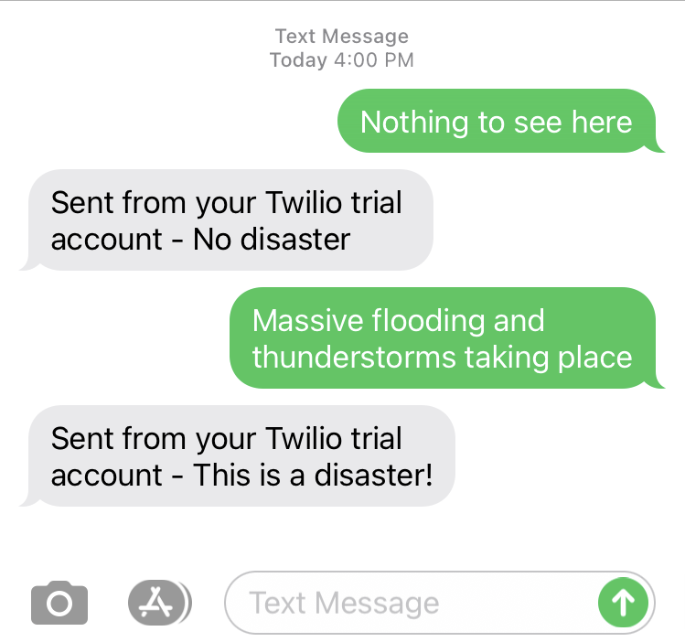

# Integrate with Twilio

To complete the new user experience, we need to integrate the `NLP Prediction Service` with [Twilio][1].  Twilio provides the communciations API so that our users can text a phone number and receive a reply from our service.

## Setup

The first step is to create a free trial account on Twilio.  You will need to enter and verify your personal phone number.  In your trial account, you will also obtain a Twilio phone number.  Your users will message this phone number to talk to the `NLP Prediction Service`.

Note: 

* You do not need a credit card to sign up
* If you already have an account, you can skip this and login to your account. 

Here are the instructions:

1. Click this [link][2] to create an account.  You will be asked to verify your personal phone number.
2. Follow these [instructions][3] to get your first Twilio phone number.

> In trial mode, you have to verify a personal phone number for Twilio to send it messages.  If you want to use a different phone number to test this lab, follow the instructions [here][4] to verify another phone number in your trial account.

## Configure

Now that you have a Twilio phone number, you need to configure a webhook URL.  Whenever a message arrives to your Twilio phone number, it will call the webhook URL and send back a reply.  In this case, the webhook URL is your `NLP Prediction Service` endpoint.

Make note of your prediction endpoint:

```execute
PREDICTION_URL=$(oc get route.serving.knative.dev prediction --template='{{.status.url}}/predict')
echo $PREDICTION_URL
```

Here are the instructions:

1. Go to the [Console Number][5] page
2. Click on the Twilio phone number you created
3. Scroll down to 'Messaging'
4. Under 'A Message Comes In, select 'Webhook' and paste in your prediction endpoint
5. Under 'A Message Comes In', make sure 'HTTP Post' is selected

It should look like this:


Make sure to click 'Save' once you are done.  You should see a blue banner confirmation:


## Test

Now for the fun part!  Text your Twilio phone number using your personal mobile device.  Remember: Your personal phone number must be verified before sending a message to Twilio.  Otherwise, Twilio will ignore your message.

Text 'Nothing to see here' and you should see:


Text 'Massive flooding and thunderstorms taking place' and you should see:



> Note: If you don't see a response, try sending the message again.  Twilio has a timeout window that is not configurable.

## Summary

You integrated the `NLP Prediction Service` with Twilio.  Now, your users can text a phone number to interact with your new service.  But we're not done yet!  Your users can't request for help based on the response.  In the next lab, you will complete the end user experience with one more integration.

[1]: https://www.twilio.com/
[2]: https://www.twilio.com/referral/SoYU8B
[3]: https://www.twilio.com/docs/usage/tutorials/how-to-use-your-free-trial-account#get-your-first-twilio-phone-number
[4]: https://www.twilio.com/docs/usage/tutorials/how-to-use-your-free-trial-account#verify-your-personal-phone-number
[5]: https://www.twilio.com/console/phone-numbers/incoming