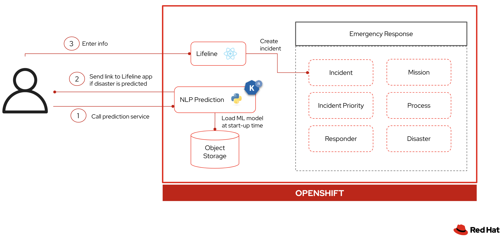

# Summary

Congratulations!  You successfully added a new machine learning capability to the Emergency Response demo using OpenShift Serverless.  

The purpose of these labs was to demonstrate how you could leverage OpenShift Serverless to enhance applications with innovative features.  Let's summarize what you did to create this innovative experience for your end users:

1. Deployed the prediction service, powered by a Natural Language Processing model, on OpenShift Serverless
2. Debugged in CodeReady Workspace and used OpenShift Serverless to rollout new releases
3. Integrated the prediction service with Twilio and Lifeline

Here is the architecture again that you built:

