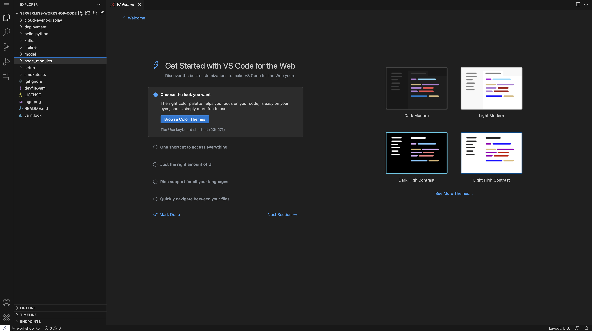
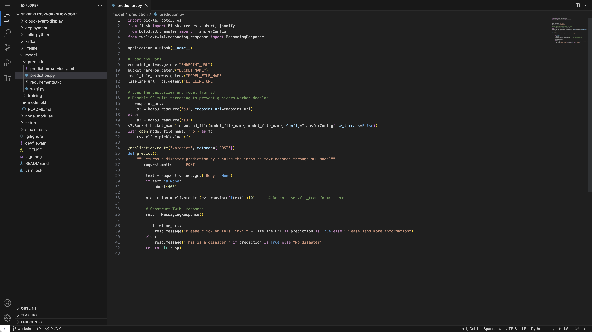
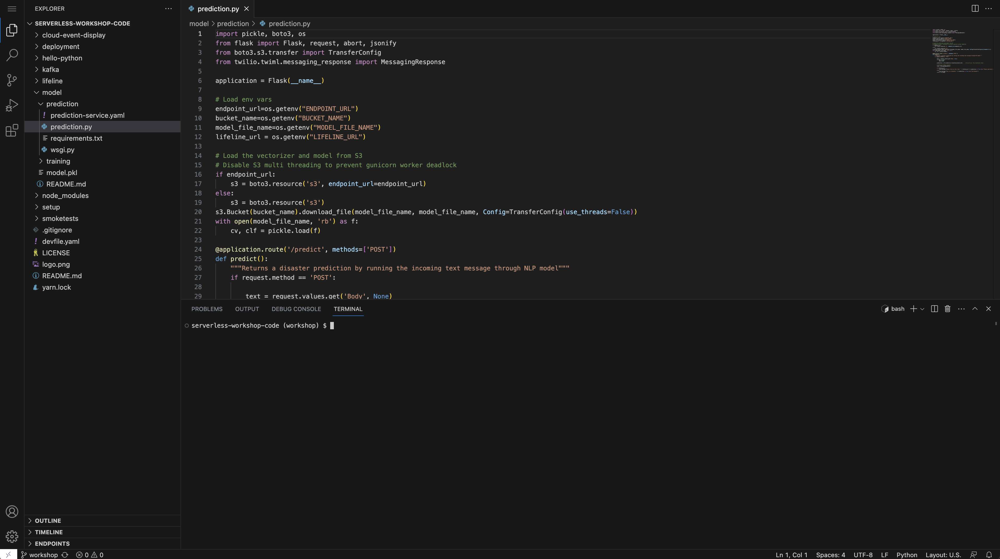

# Oops, there's a major bug!

In this lab, you will debug the `NLP Prediction Service` using [CodeReady Workspaces][1], an in-browser IDE running on OpenShift.  We have defined a workspace for you using a [devfile][2], which CodeReady Workspaces uses to create your workspace.  After debugging, you will release a new version of the code using OpenShift Serverless.

## Prep

Make a note of the following environment variables.  You will need to set these in your CodeReady Workspace terminal.

```execute
echo $AWS_ACCESS_KEY_ID
echo $AWS_SECRET_ACCESS_KEY
echo $ENDPOINT_URL
echo $BUCKET_NAME
```

## Debug

Get the endpoint to CodeReady and our devfile:

```execute
echo $(oc get route codeready -n openshift-workspaces --template='{{.spec.host}}')/f?url=https://github.com/RedHatGov/serverless-workshop-code/tree/workshop
```

Open the link in your browser.  Login using your username and password.  Authorize access to your account when requested.

You should see:


Enter fake account info and click Submit (You don't have to use real account information).

CodeReady creates a workspace for you using the devfile specified in our repo.  Wait a few minutes and you should see:



Let's pull up the code for debugging.  On the left, click the 'Explorer' icon:


Open the prediction code in the IDE, `serverless-workshop-code/model/prediction/prediction.py`:



You also need a terminal to run this code locally.  At the top, click 'Terminal' and 'Open Terminal in specific container':


Select the 'python' development container:


You should see a python terminal open in the bottom of your browser IDE:



At this point, you have access to two terminals.  Your workshop terminal (where you run your labs) and the CodeReady Workspace terminal (where you run the code locally).  

Let's configure your CodeReady Workspace terminal.  

> Execute the following steps in your CodeReady Workspace terminal.

Navigate to the prediction code directory:

```
cd serverless-workshop-code/model/prediction
```

Install the python dependencies:

```
pip install -r requirements.txt
```

Set your environment variables.  Make sure to substitute your values:

```
export AWS_ACCESS_KEY_ID=  
export AWS_SECRET_ACCESS_KEY= 
export ENDPOINT_URL=
export BUCKET_NAME=
export FLASK_APP=prediction.py
export MODEL_FILE_NAME=model.pkl
```


## Summary

[1]: https://www.redhat.com/en/technologies/jboss-middleware/codeready-workspaces
[2]: https://access.redhat.com/documentation/en-us/red_hat_codeready_workspaces/2.4/html/end-user_guide/developer-workspaces_crw#what-is-a-devfile_crw