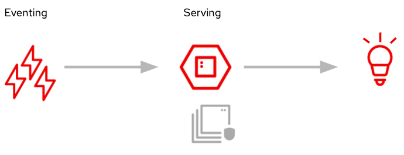

# How It Works

Red Hat OpenShift Serverless delivers Kubernetes-native, event-driven primitives for microservices, containers, and compatible Function-as-a-Service (FaaS) implementations. OpenShift Serverless provides out-of-the-box traffic routing and security capabilities. This offering combines Red Hat Operators, Knative, and Red Hat OpenShift. Combined, these tools allow stateless and serverless workloads to run across OpenShift deployments on private, public, hybrid, or multi-cloud environments with automated operations. But how exactly does this work?

## Architecture
At a high level, Serverless -- specifically the Knative project -- is composed of two main components: Eventing and Serving.  These two components work together to create an event driven architecture that is a critical part of the Serverless paradigm.

*Architecture*

### Eventing
Eventing is the part of the infrastructure for consuming external events and producing a cloud specific event called a CloudEvent.  A CloudEvent is a CNCF specfication for describing cloud event data in a common way.  It seeks to be consistent, accessible across a variety of languages, and portable.  This eventing abstraction is a useful one as it allows developers to only have to think about functional areas of the system that concerns them.  For instance, thinking about applications in an evented way allows for loosely coupled, independent services.  This also allows developers to work on specific aspects of a given application in a variety of ways:

1. Producing events that might be of interest to the system at large
2. Consuming specific events that are important to them
3. Transforming events through a series of steps

### Serving
The serving component supports deploying and the serving of the Serverless containers.  This is your container running your microservice or single function.  The serving component adds additional capabilities around your container; arguably most important being the ability for the infrastructure to "scale to zero".  This means that when a configured time has passed that your container is idle, these idle containers can actually be destroyed, resulting in no running containers.  Then when new traffic targets this service again, an activator will actually schedule your containers to be spun up to respond to these requests.
