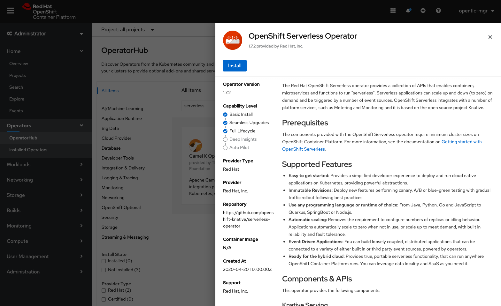
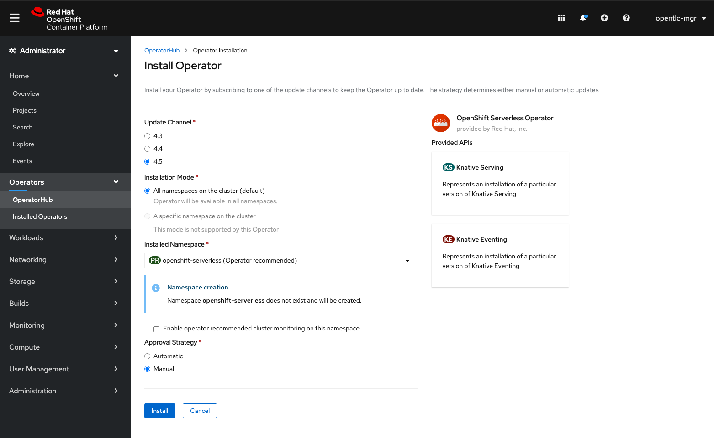
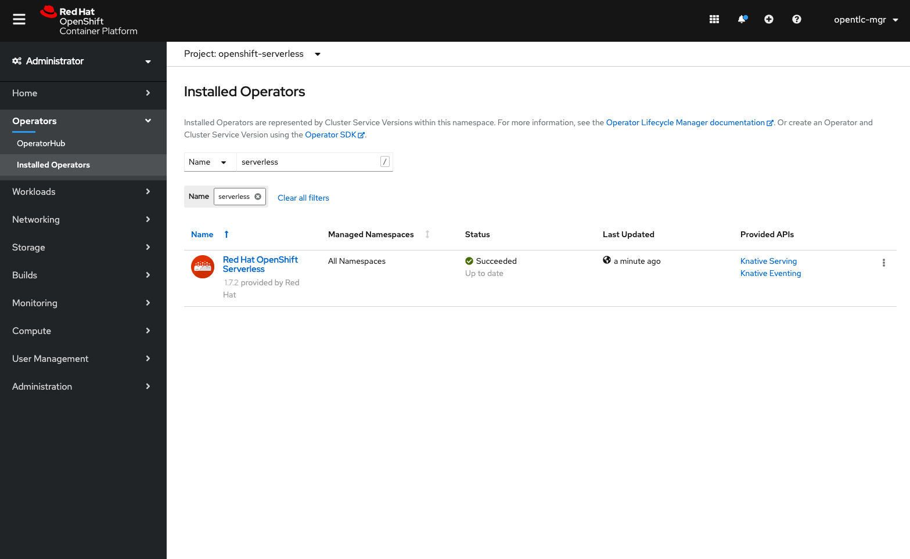

# Setup

As a preqrequisite to running these labs, you will need access to an OpenShift v4.x cluster as a cluster admin.  We also assume you have the `oc` client installed and have logged into your cluster with it.


## Operator Installation

In OpenShift, installation of Knative is very easy.  You simply need to find and install the OpenShift Serverless Operator.

*Operator Hub*

Then click install.

*Install*

Next make sure to install in all namespaces.  Select the latest Update Channel made available to you.  For the purposes of this demo, we'll pick the Manual approval strategy.  Lastly, click Subscribe.

*Subscribe*

Wait a few minutes and eventually you will see it show up as Installed Operator with the status of Succeeded

*Installed*


## Knative Serving Installation

1.  Create the `knative-serving` namespace
```
oc create namespace knative-serving
```

2.  Create a `serving.yaml`
```
apiVersion: operator.knative.dev/v1alpha1
kind: KnativeServing
metadata:
    name: knative-serving
    namespace: knative-serving
```

3.  Apply the `serving.yaml` file
```
oc apply -f serving.yaml
```

4.  Verify installation
```
oc get knativeserving.operator.knative.dev/knative-serving -n knative-serving --template='{{range .status.conditions}}{{printf "%s=%s\n" .type .status}}{{end}}'
```

Wait a while and the output should look like the following
```
DependenciesInstalled=True
DeploymentsAvailable=True
InstallSucceeded=True
Ready=True
```


## Knative Eventing Installation

1.  Create the `knative-eventing` namespace
```
oc create namespace knative-eventing
```

2.  Create an `eventing.yaml` file
```
apiVersion: operator.knative.dev/v1alpha1
kind: KnativeEventing
metadata:
    name: knative-eventing
    namespace: knative-eventing
```

3.  Apply the `eventing.yaml` file
```
oc apply -f eventing.yaml
```

4.  Verify installation
```
oc get knativeeventing.operator.knative.dev/knative-eventing \
  -n knative-eventing \
  --template='{{range .status.conditions}}{{printf "%s=%s\n" .type .status}}{{end}}'
```

Wait a while and the output will look like
```
InstallSucceeded=True
Ready=True
```

5.  Verify pod creation
```
oc get pods -n knative-eventing
```

You should see something like the following
```
NAME                                   READY   STATUS    RESTARTS   AGE
broker-controller-58765d9d49-g9zp6     1/1     Running   0          7m21s
eventing-controller-65fdd66b54-jw7bh   1/1     Running   0          7m31s
eventing-webhook-57fd74b5bd-kvhlz      1/1     Running   0          7m31s
imc-controller-5b75d458fc-ptvm2        1/1     Running   0          7m19s
imc-dispatcher-64f6d5fccb-kkc4c        1/1     Running   0          7m18s
```


## `kn` CLI Installation

`kn` is a very powerful tool for being able to control knative from the command line.

1.  Download the [CLI](https://mirror.openshift.com/pub/openshift-v4/clients/serverless/latest)
2.  Unpack and unzip the archive
```
tar -xf <file>
```
3.  Move the kn binary into your PATH
4.  Verify installation
```
kn version
```
